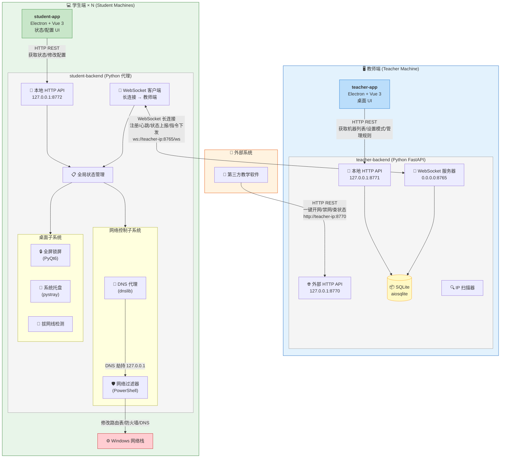

# 通信架构流程图

## 整体架构



## 通信流程说明

### 1. 教师端内部通信

```
teacher-app (Electron)  ──HTTP──▶  teacher-backend :8771
```

- 教师通过桌面 UI 操作（切换模式、管理规则、查看机器列表）
- 前端通过 Axios 调用 `http://127.0.0.1:8771/api/*`
- 后端操作 SQLite 数据库，并通过 WebSocket 向学生端下发指令

### 2. 学生端内部通信

```
student-app (Electron)  ──HTTP──▶  student-backend :8772
```

- 学生查看本机网络状态和配置
- 前端调用 `http://127.0.0.1:8772/api/*`
- 后端管理全局状态，驱动网络过滤、DNS 代理、锁屏等子系统

### 3. 教师端 ↔ 学生端（核心链路）

```
student-backend  ──WebSocket──▶  teacher-backend :8765
```

| 方向 | 消息类型 | 说明 |
|------|----------|------|
| 学生 → 教师 | `REGISTER` | 上线注册，上报主机名/IP/MAC |
| 学生 → 教师 | `HEARTBEAT` | 心跳保活（间隔 20s，超时 60s） |
| 学生 → 教师 | `STATUS` | 上报当前网络模式状态 |
| 学生 → 教师 | `BROWSING_UPDATE` | 上报 DNS 查询日志 |
| 教师 → 学生 | `SET_FILTER` | 设置网络模式（normal/whitelist/blacklist/disconnect） |
| 教师 → 学生 | `UPDATE_RULES` | 更新白名单/黑名单域名规则 |
| 教师 → 学生 | `DISCONNECT` | 断开连接 |
| 教师 → 学生 | `RECONNECT` | 重连 |
| 教师 → 学生 | `GET_STATUS` | 查询状态 |
| 双向 | `ACK` | 确认应答 |

### 4. 外部控制接口

```
第三方教学软件  ──HTTP──▶  teacher-backend :8770
```

兼容原 Network_Control 的 HTTP 接口，支持一键开网/禁网、按 IP 控制单台机器。

## 四种网络模式工作原理

| 模式 | DNS | 防火墙 | 路由表 | 效果 |
|------|-----|--------|--------|------|
| **normal** | 上游 DNS | 全部放行 | 默认网关 | 正常上网 |
| **whitelist** | 劫持到 127.0.0.1 | 默认封锁 + 白名单放行 | 删默认路由，按 DNS 解析动态加 `/32` 主机路由 | 仅允许访问白名单域名 |
| **blacklist** | 劫持到 127.0.0.1 | 清空（仅 DNS 拦截） | 默认网关 | 拦截黑名单域名，其余正常 |
| **disconnect** | 上游 DNS | 清空 | 删默认路由，仅保留到教师端 `/32` 路由 | 完全断网 |

## 端口总览

| 端口 | 服务 | 绑定地址 | 调用方 |
|------|------|----------|--------|
| `8765` | 教师端 WebSocket | `0.0.0.0` | 所有学生端后端 |
| `8770` | 教师端外部 HTTP API | `127.0.0.1` | 第三方教学软件 |
| `8771` | 教师端本地 HTTP API | `127.0.0.1` | 教师端 Electron 前端 |
| `8772` | 学生端本地 HTTP API | `127.0.0.1` | 学生端 Electron 前端 |
| `5173` | Vite Dev Server (教师端) | `127.0.0.1` | 浏览器 / Electron 开发模式 |
| `5174` | Vite Dev Server (学生端) | `127.0.0.1` | 浏览器 / Electron 开发模式 |
